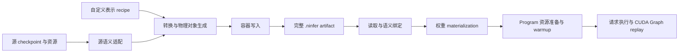

# 模型配置、权重绑定与执行的目标架构

本文是 NInfer 已收敛的模型、artifact、converter 与执行边界的目标设计合同。它描述目标系统如何
工作，不表示当前代码、容器或所有示例组合已经实现，也不展开迁移步骤或发布任务。
具体序列化字段、framing revision、目录和 C++ 类型名不在本文中提前固定。

[Engine 架构](engine-architecture.md)继续定义请求控制面、调度、资源与输出提交关系；本文规定
这些控制关系之下，模型事实、权重字节和执行实现如何组织。现有模型、Op 和存储参考中的数学与
编码合同是本文示例的依据，其 checkpoint 专属绑定方式不是目标设计的限制。

核心结果是：对于已有架构、配置和物理表示执行能力，新增训练权重实例或混合格式组合，只改变
输入数据与表示分配，不要求新增完整模型 profile、复制调度算法或注册 checkpoint 专属执行身份。
新增数学结构、codec、layout、量化生成能力或 Op 实现仍然需要相应代码。

支持判定由 Op 自己承担。系统不建立加载期的全模型能力解析器，不预先枚举并证明所有 phase、
shape 和格式组合可执行。warmup 或实际调用遇到不支持的 Op 时直接失败。容器完整性、数学配置
一致性、资源容量和模型状态事务仍有各自的合同，不因取消支持预检而消失。

## 1. 系统轮廓与适用范围

目标系统由两条相接的数据流组成：



数学结构由编译进程序的架构算法定义。Artifact 提供配置、已经转换好的权重及其解释事实。
模型的具体实现以直接 C++/CUDA 代码规定有限的执行写法，包括跨 Op 的组合与融合调用。
Program 使用实际绑定运行这些写法；各 Op 完成自身的参数适配与内部实现分派。

产品仍是一张 GPU、一个常驻模型实例、启动时固定的一至八个 active requests、有界 FIFO ingress
和每轮紧凑 decode batch。模型、artifact 和本地转换工作流受信任。推理只有公共 `.ninfer` Engine
路径；CLI、HTTP serving 和测量工具不形成另一条权重加载或模型执行路径。

执行平台仍是 RTX 5090 / `sm_120a` 的直接 C++/CUDA 实现。配置与表示解耦不引入多硬件抽象，
也不要求 artifact 指定 GPU 或 kernel。

本合同覆盖 Text、图像/视频 Vision、MTP、DFlash、已存在的 DFlash2 companion、prefix reuse、
批处理，以及通过 Engine 执行的评分与测量。它不引入任意计算图解释器、插件发现、多 GPU、请求
抢占、运行中切换权重或推理时权重重排。

Artifact 仅以 Text 主干为必需组件。Vision、MTP、DFlash、DFlash2 可以分别省略；文件包含哪些
组件与本次启动启用哪些功能独立表达。关闭的功能不要求 artifact 携带对应权重，具体合同见第 6.4 节。

## 2. 架构、配置与训练权重

### 2.1 架构定义拥有的内容

架构定义拥有数学公式、拓扑规则和状态更新规则。例如：

- attention 是否有输出 gate，Q/K 如何归一化，位置编码施加于哪些值；
- GDN 的卷积、衰减、更新、head 对应关系及递推状态含义；
- Dense SwiGLU 或包含路由、共享专家和合并的 MoE 公式；
- residual、norm、输出投影及 Vision-to-Text 接入顺序；
- MTP、DFlash 等算法的条件输入、proposal 方式和与 target verification 的关系；
- 哪些状态代表已提交前缀，哪些只是 pending round 的中间记录。

模型的具体实现直接编写实现这些数学规则的 Op 调用结构，可以从一开始就调用已有融合 Op。
数学定义不要求先物化为一份基础 Op 图，再通过融合改写得到执行程序；artifact 也不提供节点列表、
边或优化规则。实现不根据 release 名称改变公式。

### 2.2 Artifact config 拥有的内容

Config 是 NInfer 自己定义的规范化数学配置。源 checkpoint 的 config 是转换输入，不是运行时
解释任意上游字段和默认值的接口。影响计算、输入含义或模型状态的独立事实必须明确保存：

| 范围 | 典型事实 |
|---|---|
| Text 拓扑 | 层数、架构允许的每层 mixer 类型分布 |
| Text 几何 | hidden/intermediate 宽度、Q/K/V head 数与维度、GDN 卷积宽度 |
| 数学参数 | norm epsilon、gate/norm 约定的已知变体、RoPE/MRoPE 参数与位置范围 |
| MoE | 专家数、top-k、routed/shared intermediate 宽度、已知路由语义所需参数 |
| 词表关系 | 模型输出行域、可用 token 域、embedding/head 是否为同一逻辑参数 |
| Vision | 深度、维度、patch/merge 几何、位置表示、输出宽度和接入方式 |
| Speculative | 已定义算法的结构配置、feature taps、位置规则及与主模型的共享关系 |

固定于某个架构定义的公式不必复制成配置开关。只有架构确实定义了相应数学变体，config 才能选择
该变体；增加一个布尔字段本身不能实现新的模型行为。训练专用字段不进入推理 config。

规范化后，层类型序列是拓扑权威。源文件中的 attention interval 可以用来生成该序列，不再保留
第二份可能矛盾的运行时拓扑。投影行数、attention/GDN 层索引、派生 state shape 等由配置计算。
Reader 或 binder 不根据物理对象数量、名字、shape 或代表性 dtype 猜配置。

逻辑词表行、tokenizer 可寻址 token 与 layout 为 kernel 增加的 padding 必须分清。前两者具有模型
或 frontend 含义；纯存储 padding 不得变成可采样 token。模型位置范围也不等于 Engine 分配的
KV 容量。

### 2.3 不以名称判断架构等价

当前 27B 实例的源配置使用 `Qwen3_5ForConditionalGeneration`，35B-A3B 使用对应的 MoE 名称；
现有 27B 的两个 release 共用相同的配置解释和数学实现。这些事实支持相应实例共享架构，不推出
所有 Qwen release 或所有尺寸都具有相同公式。

NInfer 保留 Dense 与 MoE 两种明确的数学变体，并复用共同的 hybrid decoder、Vision 接入和事务
算法。架构标识指向这种数学合同。上游 architecture 字符串由 converter 映射到它，不成为
checkpoint registry。结构相同、配置相同而训练数值不同的 checkpoint 使用同一架构实现。

能表达一种配置、存在处理它的执行实现、它能在当前显存预算内运行，是三个独立事实。本文不承诺
所有数学上合法的尺寸均可执行，也不要求为了表达配置而同时实现或验证这些尺寸。

### 2.4 配置驱动与编译期专用化

加载后固定的层表、尺寸和组件关系可以作为普通不可变数据。C++ 仍然执行架构已定义的循环和
调用，读取层表不构成通用图解释。

真正影响实现的几何与数学变体可以选择编译期专用 kernel 或调度。例如 hidden/head 几何、卷积
宽度、Dense/MoE 算法可以专用化；模板选择不得依赖 checkpoint 名或整模型格式分配。

专用化只覆盖它实际依赖的事实。若两个模型只改变层数或参数值，而所有相关执行算法已能处理
这种变化，就不应再要求登记一个完整配置签名。不存在可处理某种几何的代码时，实际调用失败；
系统没有必须补充通用慢速实现的义务。

## 3. 数学语义、表示语义与实现精度

### 3.1 三种事实分别解释

数学语义给出从逻辑输入、逻辑参数和旧状态到输出及新状态的公式。权重表示给出文件字节所代表的
参数值。实现精度描述一个 Op 如何近似计算该公式，以及其结果适用的数值标准。

例如，NVFP4 的逻辑权重包含以下解码关系：

```text
W[n,k] = decode_e2m1(code[n,k]) * decode_e4m3fn(scale[n,k/16]) / weight_divisor
```

改变量化可能改变这里的 `W`。仅改变 layout 则必须精确保留相同的 code、scale 和逻辑对应关系。
架构相同不要求不同量化权重产生相同 logits、token 或数值误差。

浮点 Op 的独立 FP32/FP64 oracle 从表示后的公共输入和精确解码的权重计算完整逻辑公式。它不复制
生产 kernel 的 staging cast、激活量化、归约树或 workspace dtype。精确布局变换与 codec 字操作
使用独立 exact oracle；量化近似与浮点计算按相应数值或行为标准判断。

当前 BF16 公共激活、显式的 FP32 GDN control/state 等合同继续有约束力。融合内部原本只是实现
中间值的 BF16 materialization 不自动成为语义舍入边界。融合实现直接对闭合公式负责。

### 3.2 Recipe 可以约束激活计算精度

表示 recipe 除了选择持久权重格式，也可以规定某个逻辑使用位置允许的激活计算集合，并将结果
保存进 artifact。以下名称表达许可集合，而不指定 kernel：

| 策略 | 允许的私有激活计算 |
|---|---|
| `A16Only` | A16 |
| `AllowA8` | A16 或 A8 |
| `AllowA4` | A16、A8 或 A4 |

许可集合逐级包含：`A16Only ⊂ AllowA8 ⊂ AllowA4`。`AllowA4` 允许 A8，不要求每次都执行 A4。
Op 在许可集合内选择已经实现并符合数值标准的路径；许可本身不表示每种计算路径都已有实现。
Artifact 不保存 tile、MMA 指令、split-K 参数、累加类型或每个 T 对应的 kernel 名。

策略属于权重的逻辑使用位置。共享同一个 parent 的两个使用者可以有不同约束；该对象的 codec
不会因此改变。若一个融合实现必须让几个投影共享一次激活量化，则它自己负责处理这些约束以及
校准参数能否共同满足其输入合同。不满足时直接报错或选择其已有的合格实现，loader 不建立
跨投影精度兼容矩阵。

例如，同一个 gate/up parent 的 gate 使用位置允许 A4，up 使用位置只允许 A8，则共享激活计算
的许可交集为 `{A16,A8}`，不能共同选择 A4。如果 up 进一步要求 A16Only，交集就只有 A16。
交集仅约束共享的那次计算，不要求具备分别计算能力的 Op 也使用同一精度；实际实现仍需满足各
使用位置的数值与辅助输入合同。许可不能只附在物理对象上而丢掉这些逻辑使用关系。

A16 限制也可能让某个本来可以执行的 shape 不再可执行。系统不得为了成功运行而静默放宽 artifact
的许可。该策略不是逐请求改变权重或精度的接口；一个 Program 生命周期内其输入约束保持固定。

### 3.3 辅助数值的归属

权重 block/row scale、zero point 或 weight divisor 是 codec 解码事实。执行所需的 activation
calibration、input divisor 或补偿值则是相应逻辑使用位置的持久辅助输入。两者都可能需要进入
artifact，但不能混为一个 scale，也不能只凭权重 dtype 推导后者。

辅助关联至少说明已知辅助输入种类、数学使用位置、对应的输入及数值对象引用。仅写一个
`input_scale` 名称无法说明它是 norm 前还是 norm 后的输入、属于 gate 还是 down、表示
multiplier 还是 divisor。作用位置由架构的数学角色定义，不是 kernel 名或源 tensor 后缀。

同一个数学输入供多个投影使用，不保证各使用位置的校准值相同；共享必须通过明确引用表达。
即使 norm 与 projection 融合，关联仍指向同一个数学输入，不要求为了标识该输入而将其物化。
数值以具有明确类型的对象或 codec 已定义的字段保存，保持所要求的表示；文件中不能再保存一份
可独立变化的同义 scalar。

校准样本、算法版本和来源说明属于 provenance；校准生成且执行要读取的数值属于执行输入。临时
激活量化缓冲属于 Op scratch，持久 KV 编码属于运行时 state storage，均不成为持久权重格式。

## 4. 逻辑参数与物理对象的绑定

### 4.1 三个粒度

绑定使用三个相互配合的单位：

| 单位 | 含义与职责 |
|---|---|
| 逻辑参数 | 架构公式中的参数角色及 shape；用于命名、完整性和数学解释 |
| 物理对象 | 一段具有已知 codec/layout 的持久字节；用于存储、上传和所有权 |
| 闭合 Op | 拥有明确输入、输出、状态副作用和数值合同的执行调用；用于实现选择 |

一个物理对象可以承载多个逻辑参数；一个逻辑参数也可以由明确的若干片段提供。一个 Op 可以消费
多个对象，或消费完整 parent 而不构造每个参数的独立设备 tensor。三者没有一一对应要求。

逻辑参数不仅是矩阵，也包括 norm 向量、卷积核、位置表、router、selector codebook 和数学所需
scalar。绑定机制不能把模型参数集合等同于一张 Linear 列表。

### 4.2 数据对应关系

Artifact 显式说明逻辑角色对应哪些对象及其哪些部分。关系包括整对象引用、输出行范围、按
head/expert 分组的部分、物理行顺序，以及与该绑定配对的辅助值。范围和行序是在解释既有字节，
不是要求运行时执行 slice、gather、concatenate 或 transpose。

关系必须无歧义地覆盖所需逻辑参数：逻辑 shape 与 config 一致，片段无缺口或冲突，引用存在，
辅助值具有正确含义。对象名字只是 artifact 内引用句柄；源 checkpoint 名称和物理文件顺序均不
是逻辑角色的权威。

参数到对象片段的映射是 grouping 与逻辑行序的唯一权威。若 Q、K、gate、V 已分别指向同一个
parent 的明确行段，就不再要求并列保存 `form=fused_qkgv` 与另一份 `row_order`。代码可以从
绑定派生局部 payload 描述，但这些描述不成为第二份可独立修改的序列化事实。

目标绑定描述覆盖整对象引用、明确矩阵行段和已知 head/expert 分组映射，不开放任意变换表达式。
范围含义由数据合同定义，例如区间端点采用半开区间；数学层面的逻辑 shape 和对象的 stored
shape 分别保留各自含义。Loader 构造数据关系，不执行 converter 的表达式程序。

绑定完整性不能证明参数来自正确源。Q 与 gate 等角色可能具有相同 shape，错误交换其数值仍能
通过几何检查。正确的源映射、行序变换和量化内容由 converter 的转换验证保证；runtime 对已声明
逻辑绑定作确定解释，不通过输出看似合理来证明转换正确。

相同数学投影按 K 轴分片后需要求和，或者任意行重排需要 gather，并不会因为可以描述片段而自动
获得相应执行算法。Program/Op 只有其代码已经定义的组合方式。

一个普通物理对象遵循一套 codec 合同。若 Q/K 与 gate/V 需要不同格式，可以由多个对象提供，
再共同绑定到一个投影区域；无需创造一个可以随意混装 codec 的万能 tensor 格式。只有已知 codec
本身定义这种复合编码时，一个对象才具有相应内部结构。

### 4.3 Parent、零拷贝 view 与共享

Binder 保留 parent、逻辑对应关系和各个编码 plane 的信息。构造 view 时由 layout/codec 规则
计算 code、high-bit、scale、padding 和对齐关系，不能只偏移一个数据指针。

逻辑片段有效，不表示可以把它作为独立 `Weight` 传给任意 Op。某些 layout 的片段适合作为独立
view；另一些只能由理解该 grouping 的 Op 消费完整 parent。Binder 不通过复制、反量化或重排
为不适合的 consumer 生成另一份权重。

多个使用者显式引用同一对象时，其 payload 只存储和上传一次。所有别名和 view 的生命周期受
共同 owning storage 约束。逻辑角色是否完整与物理对象分配了几次分开检查，不再要求每个物理
对象只能被一个逻辑角色消费。

模型 config 中的参数共享与物理去重也应分开：共享关系说明哪些公式使用同一个逻辑参数；物理
引用说明这些值从哪里取得。不同量化结果不能伪装成同一个表示的零拷贝 alias。共享参数的不同
使用位置仍分别受自己的计算精度约束。

### 4.4 Attention 与 GDN

对于当前 27B 几何，attention 的逻辑参数及可表达 grouping 为：

```text
Q [6144,5120]    K [1024,5120]    gate [6144,5120]    V [1024,5120]

两个 parent: [Q,K] + [gate,V]
一个 parent: [Q,K,gate,V]
```

源 checkpoint 的 Q/gate 可以按 head 交错。源适配必须提取正确逻辑行，物理生成再组织目标行序；
不能直接把源矩阵分成前后两半。执行时，已有 attention projection Op 可以一次写出 Q、gate、K、V
四个最终输出，保留其融合收益。

GDN 具有 Q、K、V、Z 输入投影，A/B control，以及卷积、norm 和递推参数。QK/VZ split 与 QKVZ
fused 都是数据组织。模型的固定写法规定哪些步骤分别调用，哪些直接调用已有的 norm/control
或 projection/conv 融合 Op；各 Op 拥有自身闭合计算及 snapshot 或 replay-record 等副作用合同。
Z/A/B 不参与卷积等数学事实由架构和 Op 合同保证。

Artifact 不给一种 grouping 附带“ordinary decode 更新当前状态”这样的调度指令。同一批权重
在 prefill、普通 decode 与 verification 中由直接架构算法调用相应状态语义的 Op。

### 4.5 Dense 与 MoE

Dense gate/up 可以共存于一个 parent，由 `LinearSwiGLU` 消费；down 独立绑定，由带 residual 的
输出 Op 消费。两个对象的格式和计算许可分别存在，不需要把二者组合成整层 profile。

MoE 的逻辑参数包括 router、共享 gate、routed expert banks 和 shared expert banks。物理 expert
编号、各专家行范围、gate/up 顺序以及 scale 归属必须明确。当前闭合 `SparseMoe` 可以保留路由、
专家计算、合并和 residual，不必拆成外部逐专家 Linear 调用。

绑定可以表达不同专家使用不同格式，但现有 Op 是否接受这样的 bank 结构由实际调用决定。
一个 tensor codec 或一个普通 Linear 的支持不扩展为整个 MoE 的支持；系统没有隐式 selected-weight
gather、repack 或自动拆分执行的义务。

### 4.6 不建立完整 physical-form profile

架构定义逻辑角色和直接执行算法；codec/layout 定义表示；Op 定义自己接受的参数结构。Architecture
不额外注册每种格式、parent 组合和所有层分配，也不维护它们的全模型笛卡尔积。

可用小型 typed payload、enum 或不变的片段描述承接绑定。它们表达局部对象关系，不是选择完整
inventory、workspace 和 Program 的新 profile。新增已可消费的组合，不要求登记一个新 payload
标签来批准它。

不同 Op 的融合范围可以不同，不要求预先建立一个覆盖所有可能 fusion 的层级树。模型实现以固定
写法组织已有 Op；新增跨 Op 融合需要显式扩展相应调用写法和所需 Op 能力，不建立融合候选搜索
或局部规划器。具体职责与例子见第 11.1 节。

## 5. 所有权与依赖方向

| 所有者 | 负责的事实或行为 | 向上提供的结果 |
|---|---|---|
| 架构定义 | 数学/config 合同、逻辑参数需求、拓扑与模型状态语义 | 配置解释、语义绑定依据与数学规则 |
| 模型具体实现 | 固定的阶段调用结构、跨 Op 组合与融合调用、中间值存活期和状态操作顺序 | Program 使用的直接执行与资源组合算法 |
| Codec/layout 基础设施 | 逻辑数值解码、物理 plane、encoded size、对齐及合法 view | 可解释的物理对象与非 owning view |
| Generic artifact reader | framing、目录、资源、对象引用和 payload 范围 | 不带模型执行判断的 artifact 数据 |
| 语义 binder | 配置与逻辑参数一致性、对象和辅助值绑定、组件间关系 | 不可变模型描述与对象 materialization 需求 |
| Materializer | 已有字节的 placement、上传和 backing 所有权 | 稳定的 host/device 数据与地址 |
| Op | 闭合公式、绑定到原生调用参数的适配、参数与 state 合同、支持域、数值标准、dispatch 和 scratch 需求 | 对实际调用的准备与执行 |
| Program | 模型实例的物理状态、资源计划、直接执行和 CUDA Graph | Engine 使用的物理执行与事务结果 |
| Engine | 请求顺序、admission、缓存保留决策、结果提交和发布 | 产品请求生命周期 |
| Frontend/Gateway | 输入输出语义、tokenizer/template、媒体处理或获取、协议适配 | owning 输入与产品输出 |

Generic artifact 代码不依赖架构实现、Op 或 Engine。模型 binder 可以使用通用读取和布局设施，
但通用 reader 不回调 checkpoint binder 来解释字节。Materializer 接受对象级 placement 计划，
不接受模型执行图。

Op 接受已绑定的数值输入、权重/view、运行参数和 caller-owned scratch，不读取 artifact 名称、
recipe 或 checkpoint identity。Program 使用不可变模型描述，不在 token hot path 查询 JSON、
解析字符串、查找源 tensor 或重复绑定权重。

模型数学、输入输出 dtype、资源生命周期和 CUDA Graph 约束是相邻边界的真实连接点。系统不为
方便 registry 选择而让一个总枚举同时拥有这些事实。

## 6. `.ninfer` 的领域合同

信息归属采用以下判断：在同一个已实现架构内，如果两个合法实例可以在某个事实上不同，而且
该事实不能从其他声明唯一推导，就必须由 artifact 提供。代码拥有解释规则和算法，Program
结合启动输入与设备决定运行资源。

| 事实 | Artifact 提供 | 代码或运行时拥有 |
|---|---|---|
| Hidden size、head dimension | 具体实例值 | 类型、数学关系和具体 shape 的实现 |
| Attention/GDN 分布 | 规范化层类型序列 | 各 block 的公式与调度算法 |
| Q 投影逻辑行数 | 由 config 推导，不再独立声明为数学事实 | `query_heads × head_dimension`，并检查对象映射 |
| Norm 使用 `w` 或 `1+w` | 仅当已知架构允许实例选择时声明变体 | 固定架构约定或变体公式 |
| Codec/layout | 实际标识及其可变参数 | 数值解码、encoded size、plane 与 view 规则 |
| 固定 G64 codec 的 group size | 由 codec 标识表达，不另设独立值 | G64 的含义与实现 |
| Parent grouping 与逻辑行序 | 参数到对象片段的映射 | 数据关系构造与 Op 消费 |
| 使用位置的 input divisor 与计算许可 | 实际值/引用和许可 | 解释、数值合同及具体路径选择 |
| Workspace、KV 容量和 `2C` state 槽位 | 不作为权重文件事实保存 | Op、事务、启动选项和预算共同决定 |

目前所有已支持实例都取某个值，不足以把它提升为架构不变量。例如 kernel 只实现 head dimension
256 是执行能力事实，模型仍需声明自己的 head dimension。数学参数的预期 shape 由配置推导，
物理对象 shape 描述存储，两者通过绑定检查对应关系，并非互相替代。

### 6.1 Artifact 中必须能取得的内容

一个 artifact 自包含 Text 主干及其声明提供的可选组件所需的模型和产品输入语义。除 framing 的
解释版本外，其领域内容分成下面六组。各组按实际组成提供，不要求不存在组件的私有 config、
权重或资源；分组不固定 JSON 根字段或要求六层运行时代码：

| 内容 | 必须携带的信息与用途 |
|---|---|
| 模型与组成 | Architecture、Text config、实际提供的 Vision/MTP/DFlash/DFlash2 及各自 config 和关联 |
| 逻辑绑定 | 每个逻辑参数由哪些对象、片段和共享关系提供；行序由映射唯一说明 |
| 物理对象目录 | 对象身份、kind、shape、codec、layout、必要参数、payload offset 与 bytes |
| 使用约束与辅助关联 | 各使用位置的激活计算许可，以及辅助输入的种类、数学输入和数值引用 |
| Frontend 与产品数据 | Text 所需 tokenizer/template、token 语义、sampling defaults、公开名称；所提供组件需要的 processor 等资源及关联 |
| Payload | 已转换的权重字节、辅助 scalar/tensor 和资源字节 |

Codec 中已经固定的 group size、scale dtype 等由该 codec 身份唯一确定；支持参数化的 codec 才
读取其显式参数，不能让同一事实同时由名字和另一个可矛盾字段控制。Format 与 layout 组合必须
有明确的字节解释，但这种可解释性不等于 Op 可执行性。

Scale 可以按已知 codec 嵌入一个对象，也可以按合同引用独立对象。采用哪种方式应由真实表示
决定，不要求把所有 scale 都变成独立 tensor，也不通过固定对象后缀猜测辅助关系。

### 6.2 不属于容器执行合同的内容

源 tensor 名、checkpoint revision、转换工具版本、量化/校准过程、测量结果与 recipe 标签可以
保存在 conversion report 或非执行 metadata 中。它们用于解释来源和质量，不决定 binder、
Program 或 workspace 的分支。

派生层索引、设备地址、scratch offset、kernel、CUDA Graph、KV page 数、lane、pending round
和缓存保留策略不存入权重 artifact。前者由加载和 Program 准备计算，后者属于运行时状态。

Artifact 可以描述静态参数关系和已知数学组件，但不能附带算术节点、kernel DAG、任意 attachment
代码、执行顺序或 CUDA launch 指令。它也不能通过声明未知 format/layout 获得解释该字节的代码。

Converter 内部可以存在 slice/reshape/concat 等转换程序，文件保存这些程序的结果。Runtime 不
重放转换作业，也不从 metadata 恢复一个任意模型图。已定义 companion 的 feature 输入位置与
层索引是实例关联；在那些位置抽取并消费 feature 的过程属于架构算法。

### 6.3 完整性与物理 materialization

Reader 检查 framing、实际目录、范围、编码几何和引用等通用完整性。Binder 根据 config 检查
Text 与启动启用组件所需的逻辑参数覆盖、数学一致性和关联关系。启用组件及其共享依赖决定
需要 materialize 的对象集合；共享引用按物理对象去重。

未启用组件可以完全不存在，不能先要求其权重齐全，再仅将其标记为不上传。若文件声明提供该
组件，其数据仍遵守 artifact 合同，但启动不为它构造可执行绑定、准备私有资源或调用 Op warmup。
只由未启用组件引用的物理对象不上传；仍被 Text 或其他启用功能引用的共享对象正常保留。
组件是否存在由明确的组成信息表达，不能靠“出现了一部分同前缀对象”猜测一个新的变体。

文件 payload 和 device placement 是不同几何。Materializer 可以为设备对齐选择不同起始地址，
但上传的对象字节及其内部编码不变。Host 校准 scalar 等可以读取并保留为 owning 值；这不构成
重新生成权重。

Loader 不执行量化、反量化、融合复制、transpose、swizzle、repack 或生成第二套 kernel 权重。
其“零拷贝 view”指上传后共享既有 backing，不表示磁盘到 GPU 无需传输。

### 6.4 必需 Text 与可选组件

系统维持一个自包含 `.ninfer` artifact，其组成是 Text 主干加上 `{Vision, MTP, DFlash, DFlash2}`
的任意子集。Text 主干包含普通文本推理所需的 embedding、decoder、norm、完整输出 head、绑定及
基础 frontend 资源。Vision 和各 spec 后端都可以在文件中完全省略，不要求保留空权重、占位组件
或组件私有 config。Text-only 不需要另一种 architecture 身份或完整 profile。

“完整 artifact”指完整提供 Text 及其声明提供的组件，不指必须包含全部功能。组件使用已定义的
数学/config 和私有参数，并明确引用 target features 或共享参数；所声明的关联必须有意义。
组件组成可表达，不自动证明对应 Op 能执行其中的所有表示组合。

代码具有某项能力、artifact 提供某个组件、本次启动启用某项功能是三个不同事实。Engine 启动时
独立选择是否启用 Vision，并选择 `none` 或 MTP/DFlash/DFlash2 中一个 spec 后端；选择在生命周期
内固定。组件出现在文件中不会自动启用它。各 spec 后端可以分别存在，也可以同时存储，但不同时
运行多个 proposal backend，不要求一个任意长度、可重复实例化的 module registry。

| Artifact 组成 | 启动选择 | 必要对象与结果 |
|---|---|---|
| Text | 无 Vision、无 spec | 仅要求 Text，可执行普通文本推理 |
| Text + Vision + MTP | 无 Vision、无 spec | 仅 Text 所需对象驻留 |
| Text + DFlash | DFlash | Text、DFlash 及共享依赖，不要求 Vision 或 MTP |
| Text + Vision + MTP + DFlash2 | 仅 DFlash2 | Text、DFlash2 及共享依赖，Vision/MTP 私有对象不驻留 |
| Text + MTP | 启用 Vision | 启动时报告缺少所选 Vision 组件 |

启用功能缺少组件或必要输入属于启动配置与绑定完整性错误，不是 Op 能力预检。组件未启用时，
其缺省不影响 Text 或其他已选功能的启动；Op 支持判定继续遵循第 8 节。

所需对象按功能依赖确定，不按命名前缀判断。例如现有 `text/draft_head` 与
`text/draft_head_token_ids` 服务优化 proposal 路径，不属于 Text 主干的必需权重。仅在启用需要
它们的路径时要求它们存在；选择完整主 head 的路径不因此要求优化 proposal 对象。

分片、跨 artifact 引用、运行时外挂权重、独立 module 发布和远端迁移不是
本目标架构的组成要求。对象身份与引用也不绑定将来的分片方案。

### 6.5 已有 v2 artifact 的一次性离线升级

迁移时提供临时 Python 离线脚本，按已知 v2 合同及实际组件组成，用随脚本附带的硬编码元数据
补齐新容器描述。已有对象的 format、layout、shape 和 payload 字节保持不变，只改写 framing、
metadata 与文件位置，不重新量化或 packing。脚本使用 Python 标准库流式复制，无需源 checkpoint
或 GPU，让已有用户在本地升级已下载的 artifact，避免重新下载完整权重。

新运行时只接受新容器，直接拒绝 v2，不保留 C++ 兼容加载路径。旧合同与身份的解释仅属于这个
临时升级脚本；后续 artifact 由新版 converter 原生生成。

## 7. Converter 与自定义 recipe

Converter 的组织单位是逻辑源访问、表示分配、转换作业和容器写入。它可以用直接 Python 函数
与数据记录串接，不要求建立模型推理图或通用转换插件系统。

产物组件选择与物理表示分配独立。Converter 先确定输出包含 Text 及哪些可选组件，再展开这些
组件与共享依赖的逻辑参数需求；未选组件不要求源权重或私有资源齐全，也不建立其转换作业。
组件选择和表示 recipe 可以放在同一转换配置中，但不据此登记完整模型 profile。

```text
产物组件选择、源配置与所需资源
    → normalized config 与按逻辑参数访问源数据的入口
    → 架构/config 下所选产物组件及共享依赖的逻辑参数需求
    → 展开后的表示分配
    → 转换作业及其物理输出描述
    → 对象目录与逻辑绑定
    → 逐对象生成并写入 payload
```

| 中间产物 | 内容与后续用途 |
|---|---|
| 逻辑源访问 | 从逻辑角色取得源表达式或延迟数据句柄，可保留已量化源表示 |
| 逻辑参数需求 | 架构/config 与产物组件选择决定的角色、shape 和语义关系，不含固定物理 inventory |
| 表示分配 | 每个区域最终 codec/layout、grouping、许可与辅助值生成要求 |
| 转换作业 | 输入依赖、真正执行的变换、声明的输出对象及绑定关系 |
| 目录与绑定 | 作业输出的身份、描述和数据对应关系，交给 writer 序列化 |
| Payload | 每个作业生成的实际编码字节，与其输出描述一致 |

### 7.1 源语义适配

源适配负责把上游文件解释为逻辑模型参数：读取并规范化 config、映射名称、拆解 Q/gate 等源行序、
处理源 transpose/reshape、识别参数共享并取得产物所需的 frontend 资源。它可以从 BF16 源读取
数值，也可以解释已有量化源中的 code、scale 和 calibration。

源适配以源格式和数学结构为依据。相同命名与结构的不同训练权重无需复制适配器；上游改变字段、
行序或编码时，可以增加相应适配代码，这不成为运行时的 checkpoint 执行身份。

访问一个逻辑参数不要求立刻得到一个独立 BF16 tensor。例如逻辑 Q 可以由按 head 拆解源
`q_proj` 的延迟表达式提供；已量化源可以保留 codes、scales 和 divisor 供保值路径使用。不能
为了建立统一的逻辑接口，强制先把所有源反量化成 BF16 再重新量化。Converter 可以执行自己的
变换表达式，runtime 只看到这些表达式产生的结果。

### 7.2 表示分配

用户 recipe 面向逻辑参数路径、层范围或 expert 范围，指定 codec/layout、group/block 参数、
物理 grouping、辅助值的生成方式及激活计算许可。它不以生产 kernel 名表达目标。

Recipe 可以用默认值和范围覆盖来表达常见分配。Converter 在生成前为产物所选参数展开无歧义的完整分配；
未命中或冲突规则必须有明确结果，不能靠某个全模型 profile 补全隐藏的格式分配。Artifact 只保存
展开后的事实，不携带需要 loader 再解释的 selector、正则或继承关系。

用户可以要求原 parent 内不同逻辑部分采用不同格式。Generator 据此生成适当的多个对象或已有
复合表示，并写出完整绑定。它不通过给一个对象改 dtype 标签来伪造不同编码。

### 7.3 物理生成

Generator 消费源逻辑参数和表示分配，完成量化、校准、fuse/split、packing、layout 转换与辅助值
生成。执行顺序必须符合相应生成算法：按整个 parent 得到的 scale，不能无依据地替代分别校准
的 scale；仅改变行序也不能错误地重新量化已有 codes。

这里的 fuse/split 是逻辑参数的物理合并与拆分，结果是对象及其绑定。Converter 不据此生成或
选择模型的跨 Op 融合写法；同一个融合计算调用可以由已有入口消费单个或多个 parent。

同一 codec 的“能读取或执行”和“能从指定源生成”分别描述。当前 NVFP4 生产路径主要保留已量化
源的 codes、scales 和 divisor；不能把这个事实扩大成已经具有任意 BF16-to-NVFP4 校准器。
Recipe 选择一个没有相应 producer 的转换时，converter 自然失败，需要增加生成能力。

对象目录、尺寸、字节数、逻辑绑定与辅助引用是这一步的结果。完整物理 inventory 不再是与 recipe
并行维护的一张 checkpoint 专属权威表。实现可以流式处理参数，不要求完整模型同时驻留主存或
在 Python 中建立推理模型。

作业可以在执行前声明输出描述和绑定，执行时填入实际字节。例如一个作业取得 gate/up，组织
指定行序，产生 parent 以及配对 scalar。若实际生成条件不满足，则作业失败；不能静默更换 codec
或 grouping，使已声明的目录不再代表生成结果。

### 7.4 写入与转换证据

Writer 只序列化已生成的领域结果、安排文件 offset 和写入 payload。它不解释 Qwen 数学，不选择
量化格式或重做源映射。

对当前这类大小由 shape 和 codec/layout 决定的编码，可以先由作业输出描述安排目录与 offset，
再逐对象生产和写入。校准 scalar 的值即使稍后才得到，其 FP32 对象大小也可以提前确定。
这允许 writer 写出完整 metadata 后流式填入 payload，无需同时持有整个模型或把作业程序写入文件。

转换证据按实际操作选择：保留源量化字时检查精确对应，纯 layout 变换检查表示值不变，量化生成
按其 encoder 和数值标准验证。Recipe 改变数值表示后的模型质量与速度可以通过真实 Engine
测量，但这种工作不发展成 loader 的全组合支持检查，也不要求枚举全部可能分配。

源角色映射也属于转换正确性。两个相同 shape 的参数被交换，可能产生能绑定、能执行但不再对应
源模型的 artifact。需要验证角色与数值变换的对应，不能用 binder 通过或最终输出似乎合理替代。

调整已有格式分配时，用户修改 recipe 和必要的生成输入，不修改模型算法、C++ binder 或完整
profile。生成结果中仍可以有便于人阅读的 recipe 名称；运行时不消费该名称作执行选择。

### 7.5 Python 与 C++ 的共同合同

Converter 与 runtime 共同遵循配置字段、逻辑角色、对象绑定、codec/layout 和辅助输入合同。
可以共享狭小的数据定义与标识；源映射、转换执行和 C++ 直接模型算法仍分别拥有自己的实现。
不要求让 Python 解释 C++ Program，也不要求让 C++ 重放 Python 转换图。

两边都需要知道架构中的参数角色及 shape 关系，这是数学合同的实现。它们不能再各自维护一份
独立决定完整物理 inventory 的表。Converter 的目录是生成结果，C++ binder 依据逻辑需求检查
这个结果，而不是要求它匹配另一份 checkpoint 专属的格式分配。

## 8. 加载、Op 调用与错误边界

### 8.1 加载完成的含义

从容器建立运行时会产生四种不同结果：

```text
文件描述 → 已绑定的模型描述 → 已驻留的模型 → Program
```

| 结果 | 构造者 | 新取得的事实 |
|---|---|---|
| 文件描述 | Generic reader | Config 数据、目录、绑定记录、辅助关联、资源及 payload 范围 |
| 已绑定的模型描述 | 架构/config 解释与 binder | Text/启用组件的逻辑角色和 shape、对象片段关系、使用约束及组件关联 |
| 已驻留的模型 | Materializer 与 view 构造 | 去重后的 owning backing、稳定地址、codec/layout view 和 owning scalar |
| Program | 架构运行时与 Engine 启动输入 | 所选功能、调度、状态、workspace、控制表和 graph 资源 |

启动输入先确定所需功能，必要参数集合为 Text 加上启用组件及其依赖。Binder 检查 artifact 是否
提供这些组件，再按各自 config 绑定参数；未启用组件不必存在。共享依赖按引用解析，不把启用
DFlash 等价为同时要求 MTP，也不因源模型具有 Vision 结构就要求本文件包含 Vision。

架构入口按已知数学标识取得实现，依据 config 枚举所需逻辑参数。代码仍需知道一个 attention block
要求 Q/K/gate/V，但不再要求某个 release 的某一层必须有指定名字、指定 dtype 的物理对象。
Binder 检查数据关系，不为取得局部 payload 而预先探测所有 Op 路径。

Materializer 将所选功能引用的对象去重并上传。驻留绑定必须保留 owning 对象、parent、片段及其
code/scale plane、stride 和几何；file offset 不能直接充当可消费的 `Weight`。Reader 的临时
缓冲结束生命周期后，Program 仍需要的 scalar、资源和描述必须由相应 owner 保持有效。

权重加载完成意味着已取得可解释的模型/config，以及 Text 和所选功能的完整逻辑绑定与稳定权重。
后续 Program 初始化负责资源准备和 warmup。两步成功都不意味着每个数学上合法的请求已经被证明
具有可用 Op。

读取和绑定得到的主要不可变内容包括：

- 规范化配置、派生尺寸、拓扑和组件关系；
- 参数角色到 owning physical storage、parent/view 和辅助值的引用；
- 每个逻辑使用位置的计算许可；
- frontend 资源与产品默认值。

所选功能影响需要驻留的对象集合；功能、运行范围和状态存储策略来自 Program 启动输入，不能
反过来成为数学 config 或文件中的 kernel 计划。

这些事实足以让直接架构算法准备和调用 Op。它们不要求为每层每个 phase 填满一张已解析 kernel 表。
Kernel 选择可以留在 Op 内部按本次 shape 进行。

### 8.2 Op 拥有自身调用的支持判定

Op 的实际准备、容量查询或执行入口检查自己的格式、layout、shape、policy、aliasing 和 state
参数。闭合 Op 拥有其整体支持域，不把几个子 Linear 各自支持作为整个融合实现可用的证明。

系统不要求 Op 额外交付一份 loader 遍历的 capability schema，也不维护模型层面的
`supports_all_phases`、format/shape 笛卡尔积或 checkpoint-combination registry。Workspace 与执行
使用相同的 Op 路由事实，避免维护两份可能矛盾的支持规则。

同一闭合 Op 可以按实际 parent、shape 和 policy 选择已有的原生参数入口、kernel 或内部多 kernel
分解。这些选择服务于该 Op 的既定合同；跨 Op 的调用结构与融合安排由模型具体实现固定编写。
选择必须遵守数值与状态合同。未知组合不能触发隐式权重转换、临时生成新算法，或在失败后放宽
数值许可重试。

### 8.2.1 从逻辑绑定到原生调用参数

模型 binder 提供 typed 逻辑参数引用，保留 parent、片段、编码描述及使用约束。将这些引用整理成
具体 Op 入口需要的参数形式，由 Op 自己的局部参数准备逻辑负责；模型 binder 不维护格式组合到
重载的选择表。Op 消费普通运行时数据，不读取 artifact 名称或 JSON。

```text
逻辑参数引用及其 parent/片段
    → Op 参数准备
    → 原生调用参数形式
    → 显式调用相应重载或实现入口
    → 按实际 format/layout/shape/policy 选择 kernel
```

以 AttnInputProj 为例，模型提供 Q/K/gate/V 四个逻辑引用，不要求将它们物化成四份独立权重。
Op 可以将可消费的绑定整理成以下两种局部参数形式；名称和调用写法仅作示意：

```text
TwoParents { qk, gate_v } → attn_input_proj(x, qk, gate_v, outputs, ...)
OneParent  { qkgv }       → attn_input_proj(x, qkgv, outputs, ...)
```

双 parent 形式需要 Q/K 和 gate/V 分别对应可消费的 parent；单 parent 形式需要四者对应一个
具有所需行序与范围的 parent。匹配必须检查完整的分组、行序、范围与几何，不能只看 parent
相同、dtype 相同、同属一个 arena 或地址连续。具体格式、layout、计算许可及辅助输入能否由
该入口消费，也由 Op 处理。

C++ 重载由编译期调用签名确定，metadata 不会自动选择参数个数。Op 使用显式分支、局部变体或
等价的直接分派，走到已经编译的调用语句。模型侧可以只传一个绑定聚合对象；该聚合对象可以
引用多个物理 parent，并不要求生成单一权重 tensor。

参数形式与实现支持分开判断。例如 Q4/Q5 的两个 parent 可以进入现有双权重入口；一个 NVFP4
或 FP8 的 Q/K/gate/V parent 可以进入单权重入口。四个独立 FP8 parent 不能因为格式相同就使用
该单权重入口；Q4/FP8 两个 parent 也不因匹配双 parent 形态就自动受当前 Q4/Q5 实现支持。

准备发生在该 Op 的真实资源准备、warmup 或首次调用中，不要求 loader 扫描全部 Op。固定的
parent 关系到原生参数形式的对应可以保留为 Program 生命周期内的局部准备结果，避免每个 token
重新匹配；随 T、phase 等变化的 kernel 选择仍在实际调用或 capture 时进行。这种结果不序列化，
不成为全模型 profile，也不证明所有 shape 可执行。

Workspace 查询与执行消费同一份准备结果、使用约束和调用范围。共享一次激活量化的路径还要
满足相应使用位置的许可交集与校准关系，不能因已得到一个 parent 参数就丢弃这些约束。Graph
捕获最终具体路径，replay 不重新解析逻辑绑定。

### 8.3 哪些错误发生在哪里

| 问题 | 自然发生的位置 |
|---|---|
| Framing、offset、长度、已知 codec 的编码几何错误 | Generic reader / layout 解释 |
| 没有相应代码可解释的 architecture、codec 或 layout | 读取或构造相应语义对象时 |
| 启用了 artifact 未提供的组件 | 启动功能选择与语义 binder |
| Config 自相矛盾、Text/启用组件缺少所需参数、错误引用或行对应 | Config 解释与语义 binder |
| 对象上传失败、显存预算不足或状态布局无法构造 | Materialization / Program 资源准备 |
| 合法表示没有对应 Op 路径、shape 或 policy 不支持 | 该 Op 的准备、warmup 或实际执行 |

不为将错误刻意延迟到 CUDA launch 而跳过真实解析或虚报 workspace；也不为提前发现所有 Op 错误
而增加独立扫描。支持检查不属于 loader 的任务。

### 8.4 Warmup 与实际执行

Warmup 通过同一 Program 和 Op 路径建立所需运行环境、准备 CUDA Graph 并执行选定 workload。
成功只说明这些实际调用成功，不构成全部 prefill 长度、batch 规模、verify width 或媒体 shape
的覆盖证明。未被覆盖的组合可以在实际请求中失败。

Op 报告本次调用的 shape、表示和 policy 等事实，Program 在传播错误时补充逻辑角色/层与 phase。
错误来自真实消费点，而非“未知 weights profile”。如果失败已经发生在模型 mutation 之后，沿
Engine 的既有事务与失败规则处理；未完成的 round 不得提交或发布，不把部分状态作为可复用 continuation。不能形成
稳定 abort 时使 Engine 失败，而不是将错误当作 cache miss 或静默切换执行路线。

## 9. 不可变模型与有状态 Program

不可变模型描述拥有或受控引用本次驻留的权重 backing、所需 frontend 资源、配置和绑定。物理上传完成后，
parent/view 的地址与表示保持稳定。模型描述可以有 typed 层表和局部 payload，但不携带请求状态。

Program 独占这个 resident 实例的可变执行状态、device/control allocations、workspace、KV/GDN
stores、checkpoint/replay 数据与 CUDA Graph 资源。组件间共享的是本实例内的只读对象引用，
不是跨 Program 共用 mutable state 或 device allocations。

| 决定时机 | 固定或选择的内容 |
|---|---|
| 模型实现编写与编译 | 有限的 Op 调用结构、融合调用、显式分支与配置专用化 |
| Artifact 生成 | 提供的组件、数学配置、训练参数、持久表示、绑定、辅助值、激活计算许可 |
| 读取与绑定 | 已知架构解释、派生逻辑几何、typed 参数关系、共享对象和 view |
| Program 启动 | 功能/purpose、并发上限、上下文与 draft 运行范围、状态存储和资源 backing |
| 每次 Op 准备或执行 | 在固定权重与许可下，按实际 phase/shape 选择实现及 launch 参数 |
| CUDA Graph 捕获 | 将该具体调用序列和稳定地址记录为可 replay 的物理执行 |
| 每轮请求执行 | batch membership、有效列、position/frontier、page/slot 映射和提交结果 |

模型固定不意味着所有请求具有同一个 kernel DAG。Prefill、ordinary decode、target verification
和 draft 按模型实现中的固定写法调用相应 Op；同一个 Op 也可以随 T 选择不同实现。这些变化来自
代码中明确的分支和分派，不是从基础 Op 图动态推导融合结果，也不需要重新解释 artifact。

Engine 仍管理“谁在何时运行”和逻辑缓存保留，Program 管理“物理上如何执行和提交”。Admission
保障当前资源合同，不额外证明请求会触发的每一个 Op 都受支持。性能优化应留在其真实作用层：
模型的固定执行写法、Op 或 kernel，不能以物理自由度为理由强制统一成通用 Linear。

## 10. 状态、容量与 workspace

### 10.1 状态的数学语义

主模型状态包括已经处理的 token/position frontier、attention 所需的历史 K/V、GDN 卷积历史与
递推矩阵，以及继续计算所需 hidden。Speculative 算法还有其条件特征、私有 KV、proposal 或
continuation 数据。

状态不属于权重 inventory。它由请求执行产生，受 frontier 和事务约束；同一个架构/config 下
更换训练权重也不能继续使用另一个实例留下的状态。

GDN 的 FP32 recurrent matrix、公开 control 的 FP32 值和规定的卷积历史表示继续是生产状态
合同。改变权重 codec 不自动改变这些边界。KV 的 BF16、INT8 等已实现表示由相应 state codec、
append/attention consumer 和数值标准解释，不能用权重的 Q4/W8 名称替代。

### 10.2 存储、容量与生命周期

| 资源 | 容量依据 | 生命周期与责任 |
|---|---|---|
| 只读权重 | 所选功能引用的唯一物理对象及对齐 | Resident 实例，权重 owner |
| Main KV | Attention 几何、选定 state codec、共享 page 容量 | Program backing；请求/缓存拥有逻辑页引用 |
| GDN state | GDN 层数、head 几何、历史宽度和 state 槽位 | Program backing；current/checkpoint 内容随事务变化 |
| Draft 状态 | 所选算法配置、上下文范围、并发和 draft window | Program；仅所选 backend 驻留 |
| Replay/待提交特征 | 涉及的层和 `batch × verification width` | Pending round，未 commit 前不是前缀状态 |
| Continuation hidden/control | Hidden 几何、lane 和 checkpoint 需要 | Program backing；按请求 frontier 解释 |
| 临时激活和 Op scratch | 实际绑定、调用范围和存活期 | Caller-owned workspace 中的局部作用域 |
| Vision handoff | 启用 Vision 时，启动选定的单媒体 item 输出上限 | 从 Vision 输出到 Text scatter 完成 |

当前 current/turn-checkpoint 双平面的 GDN state 池可以保持：启动并发为 `C` 时，槽位数为
`2C`，不随 speculative window 增加。Replay records 单独按 pending verification 容量分配。
这两个数量来自事务实现，不是模型层数配置或权重格式。

共享 KV pool 不为每个 lane 平均预分固定份额。请求 admission、完整 continuation、Device/Host
replica 和缓存保留继续遵循[资源调度与上下文缓存合同](resource-scheduling-and-context-cache.md)。
配置决定状态维度，Program 决定物理 representation、容量与地址，Engine 决定逻辑保留策略。

### 10.3 从实际绑定计算资源需求

权重常驻容量按对象去重并考虑设备对齐。一个被 Text 和 draft 共同引用的 embedding/head 不能
重复计费；仅由未启用组件引用的物理对象不进入常驻容量。Host 资源与 GPU 资源分别计数。
Program 只为 Text 和启用功能准备相应状态、scratch、handoff 和 CUDA Graph 路径，不因为文件
还存有其他组件就为其预留私有执行资源或调用容量接口。

Program 根据实际绑定向它将要调用的 Op 查询 scratch 需求。查询范围来自启动时选择的 prefill
chunk、batch、draft window 和媒体容量，不来自一个完整权重 profile。模型的固定执行写法规定
跨 Op 临时数据的存活期，Op 拥有内部 scratch 的字节数和局部使用方式。资源准备按这些已写好的
调用关系组合容量与复用范围，不为降低 workspace 或 launch 数搜索另一种融合结构。

启动后预分配且地址稳定的 workspace，要求 Program 在准备时取得相应容量。取消的是独立的
完整支持证明，必要的资源查询仍需执行。Converter 估算或某次测量得到的 workspace 数字不能
作为文件权威：更换实现、phase、shape、计算许可或存活期后，这个数字就可能失效。

例如一个 Dense 层的工作区需要同时容纳跨越两个 Op 的 activation 和当前 Op scratch；gate/up
scratch 与 down scratch 可以顺序复用。另一个层的格式不同，则按那个层的实际参数获得需求。
峰值按同时存活的对象组合计算，不能把所有阶段相加，也不能机械取所有 Op 单独 scratch 的最大值。

Vision 输出交给 Text 前仍然存活，不能在 Text prefill 中被 scratch 覆盖。GDN replay 和待提交
draft features 跨越 proposal/verify/commit，也不能作为一次 projection 结束即可回收的 scratch。

资源准备可在初始化/warmup 中因容量接口无法处理某组参数而失败。这是 Op 准备的自然结果；
不另建全模型能力扫描，也不要求容量接口保证所有实际调用一定成功。容量接口与实现分派需要
共用其路由事实，确保已经选择的路径不会越过 caller 分配的范围。

### 10.4 启动后稳定的资源

启动完成前建立 weights、state、KV backing、控制表和 workspace 的 owning allocations，并为
CUDA Graph/library 开销留出独立预算。权重实际字节和 runtime 需求共同参与显存预算及 KV 容量
选择；权重格式不直接指定“这个模型应该有多少 KV”。

启动后，请求使用既有 page、slot 和 arena，不在 Op 内隐式分配 device memory。资源占用、page
ownership 和逻辑 frontier 可以变化；大块 backing 的地址与容量保持稳定。合法配置或 warmup
成功均不替代实际 admission 的资源检查。

## 11. 固定执行写法、融合与 CUDA Graph

### 11.1 模型实现直接规定调用结构

跨 Op 的组合与融合安排属于模型计算图的具体实现，以直接 C++ 调用、循环和有限的显式分支表达。
这里的“计算图实现”不要求存在独立的图对象或编译流程。数学架构定义公式、拓扑和状态语义；
具体实现给出满足这些规则的调用写法，两者也不要求拆成一套新的类层次。

本设计不引入先生成基础 Op 图、再枚举候选融合并改写图的流程，也不引入通用融合规则、成本搜索
或局部规划器。现有融合调用可以直接出现在手写实现中；Prefill、decode、verification 等阶段的
不同调用由代码明确规定，共同步骤仍可复用，不必为每条路径复制完整模型实现。

静态维护指调用结构和有限选择由开发者显式编写，并不要求所有 shape 都使用同一个 kernel DAG。
需要保留几种已知写法时，可按数学变体、phase、shape 或实际绑定事实写明确分支；这些条件只覆盖
该选择实际依赖的事实，不使用 checkpoint 名、recipe 标签或整模型格式签名选择另一份完整图。

模型实现负责跨 Op 的数据依赖、外部使用者、中间值存活期与状态操作顺序，并决定在哪里调用已有
融合 Op。Op 负责其闭合公式和状态效果，可以内部复用实现或使用多个 kernel。无需为了容纳模型
的多种调用写法而扩大一个 Op，让它包住整段模型并协调所有分支；现有闭合融合 Op 继续保留。

例如，GDN 可以沿用[当前调用结构](../../src/targets/qwen3_6/impl/runtime/text_context_impl.h)
对应的固定写法。各路径先调用 `gdn_norm_gating_proj` 取得 h、g、beta，然后执行下表中的步骤，
最后调用 gated norm 和输出投影：

| 阶段 | 投影与卷积调用 | 递推调用 |
|---|---|---|
| Prefill | 输入投影，再调用 `causal_conv1d_silu_split` | `gated_delta_net` |
| 普通 batched decode | `gdn_input_proj_conv_snapshot`，每个请求 width 为 1 | `gated_delta_net_batch_update` |
| 需要 replay 的 target verification | `gdn_input_proj_conv_record` | `gated_delta_net_replay_record` |

Norm/control 与 projection/conv 的已有融合能力直接存在于这些调用中，不是执行前搜索出来的。
Verification 的 records 仍由后续 accept/Fold/commit 消费，不能因为使用融合 Op 而提前提交状态。
表中的调用结构由模型代码决定；QK/VZ 双 parent 或 QKVZ 单 parent 的参数适配，以及 shape 决定的
内部融合或物化路径，仍属于相应 Op。这些内部路径不改变模型侧已经写好的调用关系。

新增一种跨 Op 优化时，显式修改或扩展对应模型写法及其资源关系，并实现需要的新 Op 能力。
仅更换训练数值或重新分配已有调用可消费的格式时，沿用原有写法、绑定和 Op 分派；不为每份
混合 recipe 维护一个完整 GraphImpl。没有可用 consumer 的组合按第 8 节的错误边界失败，系统
不会自动将它拆解成基础 Op 图。

### 11.2 捕获具体调用形成的 CUDA Graph

CUDA Graph 捕获固定模型写法在具体参数下产生的 kernel/launch 序列，不负责选择跨 Op 融合。
Op 的局部分派拥有内部 kernel 和 launch 选择。必要的 graph frontier 信息来自模型显式分支与
具体 Op 实现，Program 使用它来确定 capture 范围；这类准备信息不发展为 loader 的 capability schema。

一个 graph 对应当前 Program 的具体调度、phase、exact batch topology 和相应 shape/frontier
范围。若某个变量变化会改变 host 端选出的 kernel、launch geometry 或地址关系，就需要相应的
capture 区分或已定义的 device-side 参数化。

多个 Op 若沿同一个 frontier 具有分段 launch 规则，Program 可以汇合这些分界，得到该实例的
稳定 capture 区间。它不登记全模型格式组合，不为所有可能 recipe 预生成图。权重与功能在
Program 内已固定，也无需把完整逐层格式清单重复放进每个 graph key。

Request identity、有效列、KV page id、state slot 和 sampling 输入通过稳定地址中的数据传入，
不因换了请求而重新选择模型实现。每轮 compact batch 的不同 exact-B 图可以共用权重与合适的
workspace backing，同时遵守 lane/state 映射。

Warmup/capture 实际调用的 Op 可以报不支持。Graph replay 复用成功捕获的物理路径，不重复解析
配置与 descriptor。未采用 graph 的已定义路径仍直接调用同一批 Op，不形成第二个模型实现。

保留专用 kernel、融合和 graph 是结构性要求，不是对任何新 recipe 的无测量性能保证。物理混合
可能增加激活量化次数、launch 数或 scratch；Op 在许可内选择有依据的实现，测量在所声称的
operator、phase 或请求层级进行。

## 12. Text、Vision、speculative 与 prefix reuse

### 12.1 Frontend 与普通执行

Gateway 取得媒体字节并适配产品输入。Frontend 依据本实例的 tokenizer/template、processor 和
token/位置语义产生 owning prepared prompt。权重格式不改变 tokenization、媒体 acquisition
或公开 HTTP schema，也不成为 prepared prompt 的 checkpoint 标签。

Frontend 按启用功能取得所需资源。Text-only 启动不初始化 Vision processor，也不要求文件具有
图像/视频预处理资源；Text 的 tokenizer、template、token 与位置语义仍完整保留。

Vision 的 patch embedding、位置表、attention、MLP 和 merger 使用同一逻辑参数绑定机制。它们
自己的 shape 和消费 Op 不必与 Text 相同。Merger 输出进入 Text hidden 空间；image/video
placeholder 的替换和三轴 MRoPE 由 frontend/架构算法解释。

Text prefill 按固定架构和层配置使用实际绑定，推进对应 KV/GDN 状态。普通 decode 在每轮的
compact batch 上运行；输出、logprob、sampling 或选择 Op 同样消费绑定的参数。Embedding、
Linear、fused head/selection 是不同 consumer，不能彼此推导格式支持。

### 12.2 MTP

MTP 的 stem、decoder、norm 和私有参数由其已定义数学/config 描述；它使用与 Text 相同的物理
对象与绑定机制。共享 target embedding/head 必须是显式关系，MTP 的私有 layer 参数不会因为
shape 相同就引用某一层 Text 参数。

MTP 具有自己的 KV 和 hidden 对齐语义。用于移位位置的 embedding 必须保持 target 的组合输入
语义：位置落在图像/视频区域时，应使用相应 Vision 列，而非直接查 placeholder token 的词表行。
这由架构算法保证，不取决于 embedding 或 MTP projection 的 codec。

### 12.3 DFlash 与现有 companion

DFlash 拥有自己的数学/config、target feature taps、私有参数、位置规则、上下文和 proposal
算法。Target block 输出的具体取值位置属于 feature 语义；tap 的层索引和输出几何属于 config
与关联关系，不通过物理对象名字推断。

它可以显式共享 target embedding 和 proposal 使用的 head。其上下文来自 target 产生的 features，
与主模型数学中的 KV/GDN 不是同一状态。Vision 已进入 target residual stream 后，DFlash 消费
同样的 target feature 语义，无需另建一套 Vision 权重绑定。

DFlash2 的动态卷积、selector codebook 等现有参数也通过同一机制表示，同时保持其自身算法。
统一参数绑定不要求 MTP、DFlash 与 DFlash2 共用一个 proposal 数学图或一种状态布局。

### 12.4 Verification 与事务

所选 backend 提供 proposals，target verification 仍按主模型的真实混合权重计算。Greedy 与
sampling 的 accept/correction 规则保持各自合同；不能用 greedy equality 替代随机采样的概率
校正。Draft 的数值变化可以改变 proposal、接受率和速度，不改变 target 验证的权威地位。

GDN verification 产生 replay records，不立即把被拒绝尾部写成 committed state。接受前缀确定
后，Fold/commit 只推进有效前缀的 GDN、KV、continuation 和 backend 上下文；随后才发布输出。
新格式可以改变 projection 的 kernel DAG，但不能绕过这一事务顺序。

优化 proposal head、token shortlist/remap 或 selector 是已定义 proposal 算法的参数和数据。
它们不替代主模型的输出语义，也不因物理共享而获得任意跨组件执行能力。

### 12.5 Prefix reuse、批处理与评分

Prefix reuse 匹配 prepared input 语义，并复用同一 resident 执行上下文中、同一 frontier 的完整
状态。仅有 token 序列或 Main KV 不足以替代所需 GDN、continuation hidden、selected backend
状态及适用的媒体/位置上下文。

Batch compaction 只改变本轮 row 到请求/state 的映射。所有 row 使用当前 Program 的固定权重、
policy 和 backend，不能逐请求选择另一个 recipe、checkpoint 或 draft 实例。

启动固定的评分 purpose 可以使用相同的数学与绑定，在独立临时 state 上计算因果分数，不进入
generation 的 prefix catalog 或 speculative 发布流程。CLI、serving 和测量均消费 Engine 的
结果，不检查或重建权重 profile。

## 13. 身份与 provenance

| 身份或描述 | 用途 | 不能承担的职责 |
|---|---|---|
| Architecture 标识 | 选择已实现的数学合同 | 区分相同数学/config 的训练 release |
| Normalized config | 给出具体数学事实 | 保存逐层量化 recipe 或 kernel 选择 |
| 训练权重来源/实例 | 配对、来源说明、质量解释 | 批准一份 checkpoint 专属执行图 |
| Artifact 内对象句柄 | 绑定、共享和物理 ownership | 代替逻辑角色或推断模型身份 |
| 公开 model 名称 | 产品展示、请求匹配和报告 | 选择 binder、Op 或 workspace |
| Frontend 资源与 sampling defaults | 输入输出与默认产品行为 | 成为权重表示的替代 profile |
| 派生执行描述 | 性能诊断、测量匹配、Program 内资源/图解释 | 新增组合必须注册的许可标识 |

`weights_id` 不再是执行合同。人类可读的 recipe 名或从配置/绑定派生的 signature 可以帮助
理解报告，但不允许以“这个 signature 未登记”为由拒绝本来可以执行的组合。Context-cost 等
性能估计应依赖适用的运行事实或明确提供的测量，不把 release 标签当成隐含实现差别。

Tokenizer、template、token 语义与 sampling defaults 随相应实例明确提供，由 frontend/product
解释。重新训练不一定改变这些内容，也不保证它们不变。公共 OpenAI/Anthropic model 字段与协议
继续遵循其外部合同，内部去掉执行身份不等于删除产品名称。

Speculative 配对包含两个不同问题：Binder 检查结构、feature/位置与共享关系是否有意义；可信
converter 确认所用 companion 与主权重来源的实际配对。相同 architecture/config 不证明训练
配对成立。相同主权重来源上的量化变化则可能影响 draft 质量，不能以配置相同推导相同接受率。

自包含 artifact 可以记录配对来源和转换证据，不要求每次加载重新计算全模型内容哈希。没有
跨文件外挂权重接口，也就不引入跨 artifact 的动态配对协议。

Prefix/checkpoint 身份继续限定在其 resident Program 和执行语义中。两个 Program 即使有相同
architecture/config、同名 model 或相同 recipe 标签，也不能据此共享或互换缓存。

## 14. 全链路设计见证

下列例子从源输入一直推演到执行、资源和结果边界，用于检验职责是否闭合。涉及的 shape 与局部
执行路径取自现有模型/Op 合同；新的容器和全链路组合尚未实现，因此这些例子是架构可行性推演，
不是实测成功、数值质量或速度证明。示意中的逻辑路径也不是已经确定的序列化字段或可运行 recipe。

### 14.1 相同配置的新训练权重

输入是一个新的 Dense 训练实例：64 层、hidden 5120、intermediate 17408，attention/GDN、Vision
和位置语义与当前 27B 配置相同。源命名合同也相同，但权重数值不同。此例启动 Vision，关闭
speculative，产物仅包含 Text 与 Vision，不要求提供 MTP、DFlash 或 DFlash2 参数与配对。

1. 源适配器读取新数值，生成相应 Text/Vision 的 normalized config 和逻辑参数集合。换目录或 release 名不
   选择另一个运行时架构。
2. 沿用已有 groupwise 分配 recipe，重新量化新参数；frontend 资源和产品默认值从这个实例取得。
   Converter 写入新 payload、绑定和来源说明，不给运行时新增 profile。
3. Reader 解释已有 codec/layout；binder 从 config 检查逻辑参数与实际形状，再构造 split/fused
   parent 关系。其输入与选择逻辑不包含旧、新训练实例的名字分支。
4. Materializer 上传所选 Text/Vision 对象。因为配置和表示分配一致，权重几何与资源计算方法
   一致；数值变化不要求另一个 Program 类型。实际容量仍按本次启动条件计算。
5. Program 准备状态、workspace 和 graph，warmup 调用相同 Op。产品请求经该实例的 frontend
   进入 Text/Vision，输出可以与旧实例不同。
6. 本 Program 可以建立并复用自己的 prefix checkpoint。旧 resident 实例的 KV/GDN/hidden
   不因配置相同而有效，也不参与新实例的状态初始化。

这个例子闭合了训练实例、执行选择、frontend 与缓存身份四者的关系。新增数据不需要新增模型
实现，数值和产品语义仍有明确归属。

### 14.2 27B 新混合组合，经过 Vision、MTP 和批处理

使用上述 27B 数学配置，从同一训练实例的浮点参数及其可用的已量化源生成如下分配；其余参数
保持已有可生成的表示：

| 逻辑区域 | 物理表示 | 激活计算许可 |
|---|---|---|
| Attention 第 3 层输入 | `[Q,K]` Q4 `[7168,5120]`，`[gate,V]` Q5 同 shape | A16Only |
| Attention 第 7 层输入 | `[Q,K,gate,V]` FP8 `[14336,5120]` | AllowA8 |
| GDN 第 0 层输入 | QK Q4 `[4096,5120]`，VZ Q5 `[12288,5120]` | A16Only |
| GDN 第 1 层输入 | QKVZ FP8 `[16384,5120]` | AllowA8 |
| Dense 第 12 层 gate/up | NVFP4 `[34816,5120]` | AllowA4 |
| Dense 第 12 层 down | FP8 `[5120,17408]` | AllowA8 |

此处 Q4/Q5 指现有 G64/FP16-scale codec，FP8 指现有逐行 BF16-scale codec。MTP 使用自己的已有
表示与共享关系，Vision 同样使用其已有绑定。启动选择 `C=4`、MTP draft window 为 3，并启用
Vision。

第 12 层在容器中的局部信息可以具体展开为下面的对象和绑定。对象符号只用于示意；完整文件还
包含其他层和参数，且每个对象必须有 writer 给出的 offset/bytes。

| 对象 | Stored shape | Codec | Layout |
|---|---|---|---|
| P | `[34816,5120]` | NVFP4 | 已知 block-scale layout |
| D | `[5120,17408]` | FP8_E4M3FN_ROW_BF16S | 已知 row-scale layout |
| S | scalar | FP32 | Contiguous |

| 逻辑参数/使用位置 | 参数来源 | 计算许可 | NVFP4 input divisor |
|---|---|---|---|
| 第 12 层 gate | P 的 rows `[0,17408)` | AllowA4 | S |
| 第 12 层 up | P 的 rows `[17408,34816)` | AllowA4 | S |
| 第 12 层 down | D 整体 | AllowA8 | 无此辅助输入 |

S 关联 gate/up 消费的 MLP 数学输入，数值由 converter 取得；该输入的位置由架构定义。P 的
weight divisor 则位于其 codec 定义的编码中。代码从 config 推导 gate/up 各自应为
`[17408,5120]`，再检查这两个行段，不从 P 的大小反推模型 intermediate 宽度。

1. Recipe 按逻辑层展开分配。NVFP4 gate/up 取得同一训练实例已有量化源的 code、block scale、
   weight divisor 和 input divisor；FP8 down 由相应源逻辑参数通过已有 encoder 生成。它们
   不因为来自同一个 Dense 层就被强制选择相同 codec。
2. Generator 形成各层自己的对象与 parent 关系。第 3 层 split 和第 7 层 fused 都完整提供 Q、K、
   gate、V；文件中不出现要求 loader 执行 concat 的节点。
3. Binder 按同一逻辑角色体系完成绑定。第 12 层保存 gate/up 与 down 各自的表示、计算许可和
   所需辅助值，没有一个代表整模型混合方案的 enum。
4. Program 的 Dense scratch 计算保留 `[17408,T]` activation，再结合 NVFP4 `LinearSwiGLU`
   与 FP8 `LinearAdd` 的实际 scratch。GDN 按第 11.1 节中的固定阶段写法，向实际绑定对应的
   projection、snapshot、record 等 Op 查询资源；`2C` state slots 与单独的 MTP replay 容量
   由事务需要决定，不经过融合候选选择。
5. 图像/视频请求经 frontend 形成 Vision patches、Text placeholders 和位置输入。Vision merger
   产生 `[5120,V]` handoff，Text scatter 消费后才允许复用那部分 workspace。MTP 移位位置若
   落在媒体区域，继续使用对应的组合 embedding。
6. Text prefill 按已有固定写法依次调用这些不同表示的投影；第 3/7 层的 attention 和第 0/1 层
   的 GDN 分别复用相同调用结构，由各 Op 适配实际 parent 和格式。普通 decode 的 compact batch
   使用当前 lane/state 映射；MTP 生成 proposals，target verification 使用同一份混合主权重，
   验证宽度为 `draft_window+1=4`。
7. GDN record/Fold、KV commit 和 MTP continuation 只推进接受前缀，然后发布输出。Graph 捕获
   实际使用的 split/fused、A16/A4/A8 路径，不为这张分配表注册专属 graph 身份。
8. 一个后续请求命中已完成媒体段之后的可复用前缀时，恢复完整 Main KV、GDN、hidden 和 MTP
   continuation，再加入相应 batch。命中不要求重新解释 recipe，也不改变任何权重对象。

如果只将 up 的许可改为 AllowA8，而 P、D、S 及其绑定都不变，共享激活计算的许可变为
`{A16,A8}`。实际 Op 是否有可用路径由其准备或调用决定，不能因为 parent 是 NVFP4 就强制用 A4。
同一套物理权重仍然具有明确含义，变化的是使用约束及可能选择的 kernel、scratch 和 graph。

局部执行可行性的依据是已有
[attention projection](../../include/ninfer/ops/attn_input_proj.h)、
[GDN projection/state](../../include/ninfer/ops/gdn_input_proj.h)、
[LinearSwiGLU](../../include/ninfer/ops/linear_swiglu.h) 和
[LinearAdd](../../include/ninfer/ops/linear_add.h) 合同。全链路的新增部分是把这些实际绑定一致地
传给同一算法和资源准备，而不是创造新的数学、kernel 或完整 profile。数值质量与端到端速度
仍需对生成的真实实例测量，不能从这些局部接口推出。

### 14.3 MoE 混合 bank，经过 Vision、DFlash 和 prefix reuse

输入为 35B-A3B 的数学配置及其匹配 DFlash companion：40 个 Text 层、hidden 2048、256 个
routed experts、top-8 和一个 shared expert。Recipe 将其中一层的 routed gate/up 与 down 选择
为 Q4/Q6，其余相应层保留已有 Q4/Q5 组合；shared banks 与 companion 参数沿用已有表示。
产物只包含 Text、Vision 和 DFlash，MTP 与 DFlash2 可以完全省略。

除主模型与 draft 各自的 config、参数对象和绑定外，容器还需要以下关联：

| DFlash 关联事实 | Artifact 中的内容 |
|---|---|
| Target | 当前 artifact 中的主模型 |
| Feature 数学位置 | 已定义的 target decoder block residual output |
| Feature 层号 | `[1,6,11,16,22,27,32,37]` |
| Embedding | 引用主模型的逻辑 embedding 参数 |
| Full proposal head | 引用主模型的逻辑 output head 参数 |
| 私有参数 | 按 DFlash 自身 config 绑定到对应对象 |

Residual output 的准确公式位置由代码定义，具体 tap 索引由实例配置给出。文件不携带逐层 callback、
concat 作业或执行顺序；DFlash 直接算法知道如何取得和消费这些已定义输入。选择 DFlash 以及
并发、KV 容量、draft window 和各 buffer 地址来自 Program 启动与资源准备。

1. 源适配分别读取主权重和匹配 companion，确认配对来源，将八个 target feature taps 及 draft
   数学配置规范化。主模型量化变化可能影响接受率，但不生成另一个 DFlash 算法。
2. Generator 写出 routed gate/up `[256*1024,2048]`、routed down `[256*2048,512]` 的对象和
   expert 行对应。Router/shared gate、shared banks、Vision、draft 私有参数都具有自己的逻辑
   角色。Text 与 draft 共享的 embedding/head 使用同一对象引用。
3. DFlash 的一个 QKV parent 可以保存 `[6144,2048]`，行序为 Q 4096、K 1024、V 1024。
   Draft block projection 消费整个 parent；target feature context 准备消费其 K/V 行 view。
   RowSplit 的 code/scale plane 正确对应同一 backing，无需为两个使用场景复制权重。
4. 启动选择 Vision、DFlash、`C=2` 和 7 个 proposal tokens。Materializer 仅上传所选依赖，
   不要求 MTP 权重存在。Program 准备 Main KV、GDN current/checkpoint、DFlash local/full
   context、pending features 和 verification replay；共享权重不重复计费。
5. 图像/视频经 Vision-to-Text 接入后，target 在规定 block residual 输出处取得 features。
   DFlash 的 feature projection 与各层 K/V projection 构造自己的条件上下文，保留 target 的
   feature 语义和 draft 的位置规则。
6. Decode 中，`SparseMoe` 直接根据各层实际 bank 组合执行路由、专家计算与合并。DFlash 以
   anchor 与 7 个 mask 形成 proposal block；target 对这些 proposals 进行因果 verification。
7. 接受前缀确定后，Fold 提交 GDN，Main KV 推进，DFlash 仅接纳已提交 target features。
   被拒绝尾部不能成为 draft context 或 prefix checkpoint。输出随后发布。
8. 后续相同前缀的请求复用完整 target 与 DFlash continuation。Private/shared checkpoint 和
   紧凑批处理仍由既有 Program/Engine 事务处理，不根据 Q4/Q6 的层号增加专用缓存路径。

这个例子同时依赖
[SparseMoe 的闭合 bank 合同](../../include/ninfer/ops/sparse_moe.h)与
[DFlash 的 feature、位置和事务语义](qwen3.6-35b-a3b-model.md)。权重组合、组件间共享、媒体、
speculative 私有状态和主模型状态各有 owner，能够在同一个 Program 内组合。

### 14.4 可以描述的 parent 内混合，遇到没有实现的 consumer

用户希望在一层 MoE 内，让一部分专家使用 Q4 bank，另一部分专家使用 FP8 bank。假定指定源和
两个 producer 都能生成各自已知 codec/layout 的合法对象，但没有实现接受这种异构 expert bank
的 `SparseMoe` 路径。

1. Recipe 按 expert 范围分配格式。Generator 生成多个对象和覆盖所有逻辑专家的对应关系，写入
   一个完整 artifact，不把不同 codec 的字节伪装成一个普通 Q4 bank。
2. Reader 可以解释每个对象；binder 可以确认专家集合、shape 和引用一致。这些数据检查不需要
   查询 `SparseMoe` 支持域，也不要求给这种组合注册一个新模型身份。
3. 物理对象可以按其既有编码上传。Program 为该层准备实际 `SparseMoe` 输入或调用其资源接口
   时，Op 发现无法消费这种 bank 结构，报告具体层和表示组合；若此前未触发该准备，首次实际
   调用同样失败。
4. 系统不自动拆成逐专家 Linear，不 gather/repack 被选专家，也不把 FP8 临时反量化为另一种
   权重。要执行这个数据组合，需要增加相应 Op 能力。

这里没有把“能够表达”变成“必须执行”的隐含承诺，也没有为了支持范围有限而恢复完整 profile。
同样的边界适用于单独改变 Q/K 与 gate/V 后缺少对应 projection consumer 的组合。

### 14.5 合法配置或计算许可没有可用执行路径

第一种输入是同一个已知架构下的新几何。源参数、config、物理对象和所有逻辑 shape 自洽，编码
工具能够生成这些矩阵，但当前 attention Op 没有该 head/投影几何的实现。

源适配与转换可以完成，binder 按配置建立对应参数；在准备相关 state layout 或实际 attention
调用时，相应存储原语/Op 报告无法处理该几何。错误不来自未登记的尺寸名称。加入缺失的真实
实现后，同一架构/config/绑定机制可以使用它，不需要为这个训练实例复制模型算法。

第二种输入使用已知 27B 几何和 NVFP4 gate/up，但 recipe 将其使用许可设为 `A16Only`。它具有
合法 payload、scale 与绑定。现有
[LinearSwiGLU 合同](../../include/ninfer/ops/linear_swiglu.h)的 NVFP4 A16Only 路径只覆盖
`T<=16`，AllowA4 才覆盖更大 T。

如果 Program 的资源准备已经向该 Op 查询包含 `T=32` 的范围，准备便自然失败；若此前只实际
准备或执行了可处理的范围，触发不支持调用时失败。一次 `T=1` decode 成功不允许 Op 在之后
的 prefill 中绕过 A16Only。错误传播也不需要 loader 事先扫描全部 T。

这个例子明确了三条边界：配置一致性不等于执行实现存在，权重可解码不等于计算许可可满足，
warmup 不是全部调用域的支持证明。失败仍保持资源与输出事务的既有语义。

### 14.6 Attention 行序合法，不代表已有 Op 可以消费

配置声明 Q heads 24、KV heads 4、head dimension 256 和 hidden 5120。架构代码推导 Q/gate
各为 `[6144,5120]`，K/V 各为 `[1024,5120]`。两个 artifact 可以分别具有以下局部绑定：

| 逻辑参数 | Split：A 为 Q4 `[7168,5120]`，B 为 Q5 同 shape | Fused：P 为 FP8 `[14336,5120]` |
|---|---|---|
| Q | A 的 rows `[0,6144)` | P 的 rows `[0,6144)` |
| K | A 的 rows `[6144,7168)` | P 的 rows `[6144,7168)` |
| Gate | B 的 rows `[0,6144)` | P 的 rows `[7168,13312)` |
| V | B 的 rows `[6144,7168)` | P 的 rows `[13312,14336)` |

源适配取得正确的四个逻辑参数，generator 按各自 recipe 产生对象及映射，reader/binder 对应到
同一套数学参数需求。上传后，AttnInputProj 的参数准备将两列分别对应为 `TwoParents(A,B)` 与
`OneParent(P)`，显式调用双权重或单权重入口。若将 P 改为合法生成的 NVFP4 parent，逻辑映射和
单 parent 参数形式可以保持相同，后续格式分派改变。文件无需再携带 `form=fused_qkgv` 或重复
的 row-order 清单。

这些变化均发生在同一次 attention projection 调用的参数适配与内部实现中。模型仍按固定写法
继续调用归一化、RoPE 和 attention 等步骤，不先生成四次 Linear 再寻找可融合的投影。

若第三个 artifact 将 P 的物理行序改为 `[Q,gate,K,V]`，并正确生成内容和更新映射，数据关系仍然
可以合法。但只接受 `[Q,K,gate,V]` 的 Op 无法直接消费它，准备或实际调用可以失败。Loader 不
重排，不自动组成四次 Linear；支持新的消费方式需要真实的 Op 实现。

另一种错误是 converter 没有保持源角色对应，误将 Q 与 gate 的数值交换。两者 shape 相同，
binder 可能仍通过；执行结果对应的是错误的参数赋值。前一种情况是 consumer 能力不足，后一种
是源转换错误，不能用同一种“加载成功”或“输出合理”判断替代二者各自的合同。

### 14.7 两个 NVFP4 parent 不能无条件直接拼接

假定两个已量化源 parent 分别表示：

```text
W1 = decode(C1) * decode(S1) / d1
W2 = decode(C2) * decode(S2) / d2
```

目标 parent 的 NVFP4 codec 只允许一个共同 weight divisor。若 `d1 != d2`，直接拼接 codes 与
block scales，再任选一个 divisor，通常不能保持原有表示值。即使 divisor 一致，也仍需按目标
layout 正确组织 code/scale plane 与 padding，而非任意连接两个完整 payload。

Converter 先解释源表示，再依据 recipe 选择已知且成立的保值重组、从合适源重新量化、保持多个
对象，或因没有可用生成方式而失败。已支持 NVFP4 与已支持 fused parent，不能共同推出任意
NVFP4 源都可以无损融合。

生成成功后，文件只保存实际 parent 或多个对象、其编码值及正确绑定。Runtime 使用这些结果，
不收到“加载后统一 divisor”的转换作业。各使用位置的 input divisor 仍有独立关联，也不能由
统一 weight divisor 的过程顺带推导。这一转换不改变谁拥有状态、调度或 Op 支持判定。

### 14.8 仅包含 Text 的产物与按需启用

输入源属于已实现的 hybrid decoder 架构，源中可以带有 Vision 和 MTP，但本次转换只选择 Text。
Text 的数学配置与表示采用已有可执行组合，启动选择 `C=4`、关闭 Vision 和所有 spec 后端。

1. Converter 只展开 Text 主干和基础 frontend 的需求，不要求 Vision/MTP 私有源参数或另一个
   draft checkpoint。生成作业不包含可选组件，也不生成优化 proposal head 或 shortlist。
2. Writer 写出 Text config、参数绑定、表示与所需资源，组成声明中不提供 Vision/MTP/DFlash/
   DFlash2。源 config 中描述过可选组件，不成为输出 artifact 必须携带该组件的理由。
3. Reader 检查实际目录与引用，binder 只要求 Text 参数完整。不存在可选组件不导致缺少 tensor
   或 frontend processor 资源的错误，也不需要登记 Text-only 执行身份。
4. Materializer 上传 Text 引用的对象。Program 准备 Main KV、GDN 的 `2C=8` 个 current/checkpoint
   槽位及普通执行所需 workspace 和 graph；不准备 Vision handoff 或 speculative 私有资源。
5. 文本请求按固定 prefill/decode 写法执行，可以组成 compact batch，并复用本 resident 实例内
   的完整 Text continuation。权重格式仍由实际 Op 消费，组件省略不改变这些算法。

若另一次启动对同一文件显式启用 Vision 或 MTP，binder 报告缺少所选组件。错误不需要等到 Op
执行，也不表示建立了 format/shape 能力预检。若 converter 随后选择加入某个已定义组件，则生成
该组件的 config、完整绑定和必要对象；新文件仍由同一读取、绑定与固定执行机制处理。
